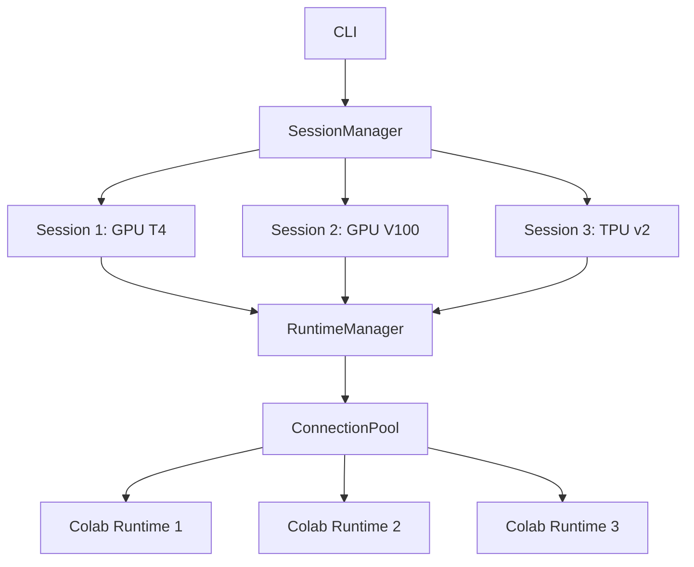

# LeCoder cGPU CLI 🚀

[](https://www.npmjs.com/package/lecoder-cgpu)
[](https://www.npmjs.com/package/lecoder-cgpu)
[](https://opensource.org/licenses/MIT)
[](https://www.typescriptlang.org/)
[](https://nodejs.org/)

**Control Google Colab from your terminal. Run code on free cloud GPUs without leaving your IDE.**

Perfect for students with Colab Pro, researchers, and developers who want programmatic access to cloud GPUs.

📦 **[npm Package](https://www.npmjs.com/package/lecoder-cgpu)** | 🚀 **[Getting Started](./GETTING_STARTED.md)** | 📚 **[Documentation](./docs/)** | 🐛 **[Report Issues](https://github.com/aryateja2106/LeCoder-cgpu-CLI/issues)**

## 🎯 Why LeCoder cGPU?

Google Colab offers free GPU access through a browser, but what if you want to:
- Run Colab notebooks from your terminal or CI/CD pipeline
- Execute code on GPUs without context switching from your IDE
- Automate ML training workflows on cloud hardware
- Use Colab's computational resources in your development workflow

**LeCoder cGPU bridges this gap.** It's a production-ready CLI that gives you full programmatic control over Google Colab runtimes.

### 🎓 Perfect for Students

If you have **Colab Pro** or **Colab Pro+**, this tool unlocks:
- 🔋 Longer runtime sessions (up to 24 hours)
- ⚡ Priority access to faster GPUs (T4, V100, A100)
- 💾 More RAM and compute units
- 🤖 Integration with AI coding assistants

Train models, run experiments, and develop ML projects - all from your terminal.

## ✨ Features

- 🚀 **One-Command Connection** - `lecoder-cgpu connect` opens an interactive shell on Colab
- 🔐 **Secure OAuth2** - Industry-standard authentication with Google
- 💻 **Remote Execution** - Run commands and stream output in real-time
- 📁 **File Transfer** - Upload/download files to/from Colab instances
- 📓 **Notebook Management** - Create, list, and manage Colab notebooks via Drive API
- 🐍 **Jupyter Kernel Mode** - Execute Python code with structured JSON output
- 🎯 **Runtime Variants** - Choose between CPU, GPU (T4), and TPU runtimes
- 🔄 **Multi-Session Support** - Manage up to 5 concurrent runtimes (Colab Pro)
- 📊 **Execution History** - Track all commands with timestamps and status
- 📝 **Comprehensive Logging** - Debug issues with detailed file-based logs
- 🤖 **AI Agent Ready** - JSON output mode for integration with AI assistants

## 📦 Installation

### Option 1: npm (Easiest - Published Package ✨)

**Requires Node.js 18+**

```bash
npm install -g lecoder-cgpu
```

That's it! Verify:
```bash
lecoder-cgpu --version
```

### Option 2: Pre-built Binaries (No Node.js required)

Download for your platform:

```bash
# macOS (Intel)
curl -L -o lecoder-cgpu https://github.com/aryateja2106/LeCoder-cgpu-CLI/releases/latest/download/lecoder-cgpu-macos-x64
chmod +x lecoder-cgpu && sudo mv lecoder-cgpu /usr/local/bin/

# macOS (Apple Silicon)
curl -L -o lecoder-cgpu https://github.com/aryateja2106/LeCoder-cgpu-CLI/releases/latest/download/lecoder-cgpu-macos-arm64
chmod +x lecoder-cgpu && sudo mv lecoder-cgpu /usr/local/bin/

# Linux (x64)
curl -L -o lecoder-cgpu https://github.com/aryateja2106/LeCoder-cgpu-CLI/releases/latest/download/lecoder-cgpu-linux-x64
chmod +x lecoder-cgpu && sudo mv lecoder-cgpu /usr/local/bin/

# Windows (PowerShell)
Invoke-WebRequest -Uri "https://github.com/aryateja2106/LeCoder-cgpu-CLI/releases/latest/download/lecoder-cgpu-win-x64.exe" -OutFile "lecoder-cgpu.exe"
```

See [INSTALLATION.md](./INSTALLATION.md) for checksum verification.

### Option 3: From Source (For Developers)

```bash
# Clone the repository
git clone https://github.com/aryateja2106/LeCoder-cgpu-CLI.git
cd LeCoder-cgpu-CLI

# Install dependencies
npm install

# Build the project
npm run build

# Link globally
npm link

# Verify
lecoder-cgpu --version
```

### System Requirements

**For Binaries:**
- No Node.js required
- ~80MB disk space per binary
- macOS 10.15+, Windows 10+, or Linux (glibc 2.17+)

**For npm:**
- Node.js 18.0.0 or higher
- npm 9.0.0 or higher

**All Methods:**
- Google Account required for Colab access

### Google Drive API Setup (Required for Notebook Features)

To use notebook management features (`notebook list`, `notebook create`, `notebook delete`), you need to enable the Google Drive API:

1. Visit: **[Google Drive API Console](https://console.cloud.google.com/apis/api/drive.googleapis.com)**
2. Click **"ENABLE"** if the API is not already enabled
3. Wait 1-2 minutes for changes to propagate

This is a one-time setup. Without it, notebook commands will return a "403 Forbidden" error.

## 🚀 Quick Start (3 Steps)

### 1️⃣ Install
```bash
npm install -g lecoder-cgpu
```

### 2️⃣ Connect to Colab
```bash
lecoder-cgpu connect
```
Opens Google OAuth → Authenticates → Drops you into an interactive GPU shell

### 3️⃣ Run Your Code
```bash
lecoder-cgpu run "python train.py"
```

**That's it!** You're now running code on free Colab GPUs from your terminal. 🎉

---

## 📖 Essential Commands

```bash
# File transfer
lecoder-cgpu upload local.py /content/remote.py
lecoder-cgpu download /content/results.csv ./local.csv

# Notebook management
lecoder-cgpu notebook list
lecoder-cgpu notebook create "My Project" --template gpu

# System info
lecoder-cgpu status               # Check connection & GPU
lecoder-cgpu logs                 # View execution history

# Multi-session (Colab Pro)
lecoder-cgpu sessions list        # List all sessions
lecoder-cgpu sessions switch <id> # Switch active session

# Version & Updates
lecoder-cgpu --version            # Check current version
lecoder-cgpu upgrade              # Upgrade to latest version
lecoder-cgpu upgrade --check      # Check for updates without installing
```

📚 **[Complete API Reference](./docs/api-reference.md)** | 🔧 **[Troubleshooting](./TROUBLESHOOTING.md)**

### 6️⃣ Manage Multiple Sessions (Colab Pro)

If you have Colab Pro or Pro+, you can manage up to 5 concurrent runtimes:

```bash
# List all active sessions
lecoder-cgpu sessions list

# List with detailed stats
lecoder-cgpu sessions list --stats

# Create a new session
lecoder-cgpu run "python script.py" --new-runtime

# Switch to a specific session
lecoder-cgpu sessions switch <session-id>

# Close a session
lecoder-cgpu sessions close <session-id>

# Clean up stale sessions
lecoder-cgpu sessions clean
```

**Target a specific session:**
```bash
# Use -s or --session flag
lecoder-cgpu -s <session-id> run "python train.py"
lecoder-cgpu --session <session-id> connect
```

## 📚 Complete Documentation

- **[Installation Guide](./INSTALLATION.md)** - Detailed setup instructions
- **[Usage Examples](./docs/)** - Common workflows and recipes
- **[API Reference](./docs/)** - Complete command reference
- **[Troubleshooting](./TROUBLESHOOTING.md)** - Common issues and solutions
- **[Contributing](./CONTRIBUTING.md)** - How to contribute to the project
- **[Roadmap](./ROADMAP.md)** - Future plans and features

## 🎯 Common Use Cases

### For Students

```bash
# Connect to Colab Pro GPU
lecoder-cgpu connect --variant gpu

# Upload your assignment
lecoder-cgpu upload assignment.py /content/assignment.py

# Run training
lecoder-cgpu run "python assignment.py"

# Download results
lecoder-cgpu download /content/results.txt ./results.txt
```

### For ML Engineers

```bash
# Start a long-running training job
lecoder-cgpu run "python train.py --epochs 100" --background

# Check execution history
lecoder-cgpu history

# Get logs from last run
lecoder-cgpu logs
```

### For AI Agent Integration

```bash
# Execute Python with structured output
lecoder-cgpu kernel execute --json << 'EOF'
import torch
print(f"CUDA available: {torch.cuda.is_available()}")
print(f"GPU count: {torch.cuda.device_count()}")
EOF
```

## 🏗️ Architecture

```
┌─────────────────┐
│   Your Terminal │
└────────┬────────┘
         │
         │ HTTPS + OAuth2
         ▼
┌─────────────────┐
│  LeCoder cGPU   │ ◄── TypeScript CLI
│      CLI        │     Commander.js
└────────┬────────┘     Chalk, Ora
         │
         ├──► Google OAuth2 (PKCE)
         ├──► Google Drive API (Notebook CRUD)
         ├──► Google Colab API (Runtime Management)
         └──► Jupyter Protocol (Code Execution)
                     │
                     ▼
         ┌─────────────────────┐
         │  Colab Runtime      │
         │  ┌──────────────┐   │
         │  │   GPU/TPU    │   │
         │  │   Python     │   │
         │  │   Libraries  │   │
         │  └──────────────┘   │
         └─────────────────────┘
```

## 🔐 Security & Privacy

- **OAuth 2.0 with PKCE**: Industry-standard secure authentication
- **Minimal Scopes**: Only requests necessary Google permissions
  - `https://www.googleapis.com/auth/colab`
  - `https://www.googleapis.com/auth/drive.file` (app-created files only)
- **No Data Storage**: Credentials stored locally, never transmitted to third parties
- **Open Source**: Full transparency - audit the code yourself
- **0 Production Vulnerabilities**: Verified with npm audit

See [SECURITY.md](./SECURITY.md) for our security policy and vulnerability reporting.

## 📊 Project Status

- ✅ **v0.5.0**: Binary distribution across all platforms (macOS, Windows, Linux)
- ✅ **v0.4.0**: Notebook Management + Drive Integration
- ✅ **v0.3.0**: Execution History + JSON Output
- ✅ **v0.2.0**: Jupyter Kernel Mode
- ✅ **v0.1.0**: Core CLI + OAuth + Runtime Management

**Current Status**: Production-ready, actively maintained

## Commands Reference

### `connect`

Authenticate and open a terminal or Jupyter kernel session on a Colab GPU runtime.

**Options:**
- `-m, --mode <type>` - Connection mode: `terminal` (default) or `kernel`
- `--new-runtime` - Request a brand-new runtime instead of reusing
- `--startup-command <cmd>` - Custom command to run after connection (terminal mode)
- `--startup-code <code>` - Python code to execute on startup (kernel mode)
- `--tpu` - Request a TPU runtime instead of GPU
- `--cpu` - Request a CPU-only runtime

**Examples:**
```bash
# Terminal mode (default)
lecoder-cgpu connect --startup-command "pip install torch"

# Jupyter kernel mode - Interactive Python REPL
lecoder-cgpu connect --mode kernel

# Kernel mode with startup code
lecoder-cgpu connect --mode kernel --startup-code "import torch; print(torch.cuda.is_available())"
```

### `run <command...>`

Run a shell command or Python code on a Colab runtime.

**Options:**
- `-m, --mode <type>` - Execution mode: `terminal` (default) for shell commands, `kernel` for Python code
- `--new-runtime` - Request a brand-new runtime
- `--tpu` - Request a TPU runtime
- `--cpu` - Request a CPU runtime
- `-v, --verbose` - Show detailed logging
- `--json` - Output results as JSON for machine parsing

**Examples:**
```bash
# Terminal mode (default) - Shell commands
lecoder-cgpu run "python train.py --epochs 10"
lecoder-cgpu run nvidia-smi

# Kernel mode - Python code with structured error reporting
lecoder-cgpu run --mode kernel "import torch; print(torch.cuda.is_available())"
lecoder-cgpu run --mode kernel "import numpy as np; print(np.random.randn(3, 3))"
```

**Execution Modes:**
- **Terminal mode** (default): Executes shell commands via WebSocket terminal, captures exit codes, streams output line-by-line
- **Kernel mode**: Executes Python code via Jupyter kernel, provides structured error reporting with tracebacks, supports multi-line code

### `copy <source> [destination]`

Upload a local file to your Colab runtime.

**Options:**
- `--new-runtime` - Request a brand-new runtime
- `--tpu` - Request a TPU runtime
- `--cpu` - Request a CPU runtime

**Example:**
```bash
lecoder-cgpu copy model.pth /content/models/
```

### `status`

Show authentication status and active runtime details.

**Options:**
- `--json` - Output status as JSON for machine parsing

Displays:
- Authentication status and eligible GPUs
- Active runtime information (GPU type, accelerator, endpoint)
- GPU details (name, memory usage, utilization) for GPU runtimes
- Kernel status (name, execution state, connections)
- Connection status (Connected/Disconnected)

**Example output:**
```
✓ Authenticated as user@example.com
  Eligible GPUs: T4, A100

Active Runtimes:
┌─ Runtime: Colab GPU T4
│  Endpoint: abc123-dot-colab-notebooks.googleusercontent.com
│  Accelerator: T4
│  GPU: Tesla T4
│  GPU Memory: 2.1 GB / 15.0 GB (14%)
│  GPU Utilization: 0%
│  Kernel: python3 (idle)
│  Connections: 1
│  Status: Connected
└─
```

### `auth`

Authenticate or re-authenticate with Google Colab. Triggers the OAuth flow and optionally validates credentials.

**Options:**
- `-f, --force` - Skip confirmation prompt if already authenticated
- `--validate` - Verify credentials with a test API call to Colab

**Global Option Interaction:**
- `--force-login` - When used globally (e.g., `lecoder-cgpu --force-login auth`), always discards cached sessions and forces a fresh login, bypassing the confirmation prompt.

**Examples:**
```bash
# First-time authentication
lecoder-cgpu auth

# Force re-authentication without prompt
lecoder-cgpu auth --force

# Use global --force-login to force fresh authentication
lecoder-cgpu --force-login auth

# Authenticate and validate credentials
lecoder-cgpu auth --validate
```

### `logout`

Forget cached credentials and sign out.

### `notebook list`

List your Colab notebooks from Google Drive.

**Options:**
- `-n, --limit <number>` - Maximum number of notebooks to show (default: 50)
- `--order-by <field>` - Sort by: `name`, `createdTime`, `modifiedTime` (default: modifiedTime)
- `--json` - Output as JSON

**Example:**
```bash
lecoder-cgpu notebook list --limit 10 --order-by name
```

### `notebook create <name>`

Create a new Colab notebook in your Drive.

**Arguments:**
- `<name>` - Notebook name (`.ipynb` extension added automatically if missing)

**Options:**
- `-t, --template <type>` - Template: `default`, `gpu`, `tpu` (default: default)
- `--json` - Output as JSON

**Examples:**
```bash
# Create a minimal notebook
lecoder-cgpu notebook create "my-experiment"

# Create with GPU template (includes nvidia-smi and PyTorch GPU detection)
lecoder-cgpu notebook create "gpu-training" --template gpu

# Create with TPU template
lecoder-cgpu notebook create "tpu-training" --template tpu
```

**Templates:**
- `default` - Minimal notebook with markdown introduction
- `gpu` - Includes GPU detection cells (nvidia-smi, PyTorch CUDA check)
- `tpu` - Includes TPU detection and setup cells

### `notebook delete <id>`

Delete a Colab notebook from your Drive.

**Arguments:**
- `<id>` - Notebook file ID from Drive

**Options:**
- `-f, --force` - Skip confirmation prompt
- `--json` - Output as JSON

**Example:**
```bash
lecoder-cgpu notebook delete abc123xyz --force
```

### `notebook open <id>`

Open a Colab notebook and connect to runtime.

**Arguments:**
- `<id>` - Notebook file ID from Drive

**Options:**
- `-m, --mode <type>` - Connection mode: `terminal`, `kernel` (default: kernel)
- `--new-runtime` - Request a brand-new runtime
- `--tpu` - Request a TPU runtime
- `--cpu` - Request a CPU runtime
- `--startup-code <code>` - Python code to execute on startup (kernel mode)

**Example:**
```bash
# Open notebook in kernel mode
lecoder-cgpu notebook open abc123xyz

# Open with fresh runtime
lecoder-cgpu notebook open abc123xyz --new-runtime

# Open with TPU
lecoder-cgpu notebook open abc123xyz --tpu
```

**Note:** On first run after upgrading to v0.4.0 or later, you'll be prompted to re-authenticate to grant Google Drive access.

### `logs`

Retrieve execution history from previous runs.

**Options:**
- `-n, --limit <number>` - Maximum number of entries to show (default: 50)
- `--status <status>` - Filter by status: `ok`, `error`, `abort`
- `--category <category>` - Filter by error category
- `--since <date>` - Show entries since date (ISO 8601 or relative like '1h', '1d')
- `--mode <mode>` - Filter by execution mode: `terminal`, `kernel`
- `--json` - Output as JSON
- `--clear` - Clear all execution history
- `--stats` - Show summary statistics instead of entries

**Examples:**
```bash
# View last 10 executions
lecoder-cgpu logs -n 10

# View failed executions from the last hour
lecoder-cgpu logs --status error --since 1h

# View import errors
lecoder-cgpu logs --category import

# View kernel executions only
lecoder-cgpu logs --mode kernel

# Get statistics
lecoder-cgpu logs --stats

# Output as JSON for scripts
lecoder-cgpu logs --json
```

### `serve`

Start an OpenAI-compatible API server backed by Google Gemini.

**Options:**
- `-p, --port <number>` - Port to listen on (default: 8080)
- `-H, --host <string>` - Host to listen on (default: 127.0.0.1)
- `--gemini-bin <path>` - Path to gemini executable
- `--default-model <model>` - Default model (default: gemini-2.0-flash)
- `--list-models` - List available Gemini models

### `upgrade`

Check for updates and upgrade to the latest version.

**Options:**
- `--check` - Only check for updates without installing
- `--beta` - Install the beta version instead of stable

**Examples:**
```bash
# Check current version
lecoder-cgpu --version

# Check for updates
lecoder-cgpu upgrade --check

# Upgrade to latest stable version
lecoder-cgpu upgrade

# Upgrade to beta (for testing new features)
lecoder-cgpu upgrade --beta
```

## Global Options

- `-v, --version` - Output the current version
- `-c, --config <path>` - Path to config file
- `--force-login` - Ignore cached session and re-authenticate

## Jupyter Kernel Mode

Kernel mode provides direct Python code execution through the Jupyter kernel protocol, designed for AI agents and programmatic use cases.

### Terminal vs Kernel Mode

| Feature | Terminal Mode | Kernel Mode |
|---------|--------------|-------------|
| Interface | Shell (bash) | Python REPL |
| Output | Raw text stream | Structured (stdout, stderr, errors) |
| Error handling | Exit codes | Python exceptions with tracebacks |
| Rich output | No | Yes (HTML, images via display_data) |
| Multi-line input | Shell-style | Python-style with `\` continuation |
| Best for | System commands, scripts | Python development, AI agents |

### Using Kernel Mode

```bash
# Start an interactive Python REPL
lecoder-cgpu connect --mode kernel

# With startup code to import dependencies
lecoder-cgpu connect --mode kernel --startup-code "import numpy as np; import torch"
```

### Kernel REPL Features

When in kernel mode, you get an IPython-like REPL:

```
In [1]: print("Hello, Colab!")
Hello, Colab!
  (15ms)

In [2]: import torch
  (1250ms)

In [3]: torch.cuda.is_available()
True
  (5ms)

In [4]: 1 / 0
ZeroDivisionError: division by zero
  Traceback (most recent call last):
    File "<cell 4>", line 1, in <module>
  ZeroDivisionError: division by zero
  (3ms)
```

### Multi-line Input

End a line with `\` to continue on the next line:

```
In [5]: def fibonacci(n): \
   ...:     if n <= 1: \
   ...:         return n \
   ...:     return fibonacci(n-1) + fibonacci(n-2)
  (2ms)

In [6]: fibonacci(10)
55
  (5ms)
```

### Exiting

- Type `exit` or `quit` to exit gracefully
- Press `Ctrl+C` once to interrupt running code
- Press `Ctrl+C` twice quickly to force exit

## JSON Output Mode for AI Agents

All execution commands support `--json` flag for machine-readable output, perfect for AI agents and automation.

### Error Codes Reference

| Code | Category | Description | Common Causes |
|------|----------|-------------|---------------|
| 0 | SUCCESS | Execution completed successfully | N/A |
| 1001 | SYNTAX | Python syntax error | Typos, incorrect indentation, invalid Python syntax |
| 1002 | RUNTIME | Runtime error during execution | NameError, TypeError, ValueError, AttributeError |
| 1003 | TIMEOUT | Execution timed out or was interrupted | Long-running code, infinite loops, KeyboardInterrupt |
| 1004 | MEMORY | Out of memory error | Large tensors, memory leaks, insufficient GPU memory |
| 1005 | IMPORT | Module import failed | Missing dependencies, incorrect module names |
| 1006 | IO | File or resource access error | File not found, permission denied, disk full |
| 1999 | UNKNOWN | Unrecognized error type | Unexpected exceptions, system errors |

### Example: JSON Output

```bash
lecoder-cgpu run --json --mode kernel "import torch; print(torch.cuda.is_available())"
```

**Output:**
```json
{
  "status": "ok",
  "errorCode": 0,
  "stdout": "True\\n",
  "timing": {
    "started": "2024-01-01T12:00:00.000Z",
    "completed": "2024-01-01T12:00:01.234Z",
    "duration_ms": 1234
  },
  "execution_count": 1
}
```

**Error Example:**
```json
{
  "status": "error",
  "errorCode": 1005,
  "error": {
    "name": "ImportError",
    "message": "No module named 'pandas'",
    "category": "import",
    "description": "Import Error - A required module could not be imported",
    "traceback": ["Traceback (most recent call last):", "..."],
    "suggestion": "Install missing module with: pip install pandas"
  }
}
```

For detailed integration examples with Python, Node.js, and LangChain, see [docs/agent-integration.md](docs/agent-integration.md).

## Execution History

LeCoder cGPU automatically tracks all executions in `~/.config/lecoder-cgpu/state/history.jsonl`. Use the `logs` command to query history:

```bash
# View recent executions
lecoder-cgpu logs -n 20

# Filter by error type
lecoder-cgpu logs --status error --category import

# View statistics
lecoder-cgpu logs --stats
```

History storage includes:
- Command/code executed
- Execution mode (terminal/kernel)
- Runtime information
- Status and error details
- Timing information
- Error codes and categories

## 🤝 Contributing

We welcome contributions! Whether you're fixing bugs, adding features, or improving documentation.

**Quick Start for Contributors:**

```bash
# Fork and clone
git clone https://github.com/YOUR_USERNAME/LeCoder-cgpu-CLI.git
cd LeCoder-cgpu-CLI

# Install dependencies
npm install

# Run tests
npm test

# Build
npm run build
```

See [CONTRIBUTING.md](./CONTRIBUTING.md) for detailed guidelines.

## 🗺️ Roadmap

### v0.5.0 (Released)
- ✅ Binary releases for macOS, Windows, Linux
- ✅ GitHub Actions CI/CD for automated builds
- ✅ SHA256 checksums for release verification

See [CHANGELOG.md](./CHANGELOG.md) for v0.5.0 release details.

### v0.6.0 (In Progress)
- 🐳 Docker container support
- 📦 Package manager distribution (Homebrew, apt, Chocolatey)
- 📊 Enhanced progress tracking for long-running jobs

### v0.7.0
- 🔄 Workspace synchronization (auto-sync local folders)
- 📝 Notebook execution from CLI
- 🎨 Custom runtime configurations

### v1.0.0
- 📈 Performance monitoring and metrics
- 🌐 Multi-account support
- 🔌 Plugin system for extensions

See [ROADMAP.md](./ROADMAP.md) for the complete roadmap and feature requests.

## 🐛 Troubleshooting

### Common Issues

**Authentication fails:**
```bash
# Clear credentials and re-authenticate
rm -rf ~/.lecoder-cgpu
lecoder-cgpu connect
```

**Runtime won't start:**
```bash
# Check Colab status
lecoder-cgpu status

# Try manual runtime creation in Colab UI first
```

**Command hangs:**
```bash
# Enable verbose logging
lecoder-cgpu --verbose run "your command"
```

See [TROUBLESHOOTING.md](./TROUBLESHOOTING.md) for more solutions.

## 📄 License

MIT License - see [LICENSE](./LICENSE) for details.

## 🙏 Acknowledgments

- Google Colab team for the incredible free GPU platform
- The open-source community for inspiration and tools
- Contributors who help improve this project

## 📞 Support & Community

- 🐛 **Bug Reports**: [GitHub Issues](https://github.com/aryateja2106/LeCoder-cgpu-CLI/issues)
- 💬 **Discussions**: [GitHub Discussions](https://github.com/aryateja2106/LeCoder-cgpu-CLI/discussions)
- 📧 **Email**: aryateja2106@gmail.com (for security issues only)
- ⭐ **Star this repo** if you find it useful!

## 🚀 Get Started Now

```bash
npm install -g lecoder-cgpu
lecoder-cgpu connect
# You're now connected to a free GPU! 🎉
```

---

**Made with ❤️ for students, researchers, and developers who love cloud GPUs**

*Not affiliated with Google or Google Colab. This is an independent open-source project.*

## Configuration

LeCoder cGPU stores configuration and credentials in:
- macOS/Linux: `~/.config/lecoder-cgpu/`
- Windows: `%APPDATA%/lecoder-cgpu/`

Configuration files:
- `auth.json` - OAuth credentials and session
- `state/history.jsonl` - Execution history (auto-rotated at 10MB)

## Development

### Prerequisites

- Node.js 18+
- TypeScript 5.4+

### Setup

```bash
npm install
npm run build
```

### Scripts

- `npm run dev` - Run CLI in development mode
- `npm run build` - Compile TypeScript to JavaScript
- `npm run test` - Run test suite
- `npm run test:watch` - Run tests in watch mode
- `npm run lint` - Type-check without emitting files
- `npm run clean` - Remove build artifacts

### Building Binaries

```bash
npm run pkg:macos     # Build for macOS (x64 + arm64)
npm run pkg:windows   # Build for Windows (x64)
npm run pkg:linux     # Build for Linux (x64 + arm64)
npm run pkg:all       # Build for all platforms
```

## Troubleshooting

### Authentication Issues

If you encounter authentication errors, use the dedicated `auth` command:

```bash
# Recommended: Re-authenticate explicitly
lecoder-cgpu auth --force

# Alternative: Logout and authenticate with another command
lecoder-cgpu logout
lecoder-cgpu connect
```

### Permission Denied Running `lecoder-cgpu`

If the shell reports `permission denied` when invoking `lecoder-cgpu`, rebuild to refresh the executable bit:

```bash
npm run build && npm link
```

Or run directly with Node:

```bash
node dist/src/index.js <command>
```

### Debug Mode

Enable detailed logging to console:

```bash
export LECODER_CGPU_DEBUG=1
lecoder-cgpu <command>
```

**View persistent logs:**
```bash
# Show recent logs
lecoder-cgpu debug show

# Show all log files
lecoder-cgpu debug list

# Get logs directory path
lecoder-cgpu debug path

# View latest entries
lecoder-cgpu debug tail
```

See [docs/logging.md](docs/logging.md) for comprehensive logging documentation.

## 🔀 Multi-Session Workflows (Pro Users)

Colab Pro users can manage up to 5 concurrent runtimes. Here's how to leverage multi-session capabilities:

### Creating Multiple Sessions

```bash
# Create sessions for different experiments
lecoder-cgpu run "python train.py --config exp1" --new-runtime
lecoder-cgpu run "python train.py --config exp2" --new-runtime
lecoder-cgpu run "python train.py --config exp3" --new-runtime

# List all active sessions
lecoder-cgpu sessions list --stats
```

### Switching Between Sessions

```bash
# View available sessions
lecoder-cgpu sessions list

# Output:
# ID              LABEL           VARIANT  STATUS     LAST USED
# session-abc123  Session 1       GPU T4   active     2 min ago
# session-def456  Session 2       GPU V100 idle       15 min ago
# session-ghi789  Session 3       TPU v2   idle       1 hour ago

# Switch to a specific session
lecoder-cgpu sessions switch session-def456

# Run command in specific session
lecoder-cgpu run "nvidia-smi" --session session-ghi789
```

### Monitoring Sessions

```bash
# View session statistics
lecoder-cgpu sessions list --stats

# Output:
# Sessions: 3/5 (Pro tier)
# Active: 1
# Total CCU used: 45/500

# Check GPU status across sessions
for id in $(lecoder-cgpu sessions list --json | jq -r '.[].id'); do
  echo "=== Session: $id ==="
  lecoder-cgpu run "nvidia-smi --query-gpu=name,memory.used --format=csv" --session "$id" --json
done
```

### Cleanup Stale Sessions

```bash
# Clean up inactive sessions
lecoder-cgpu sessions clean

# Force close a specific session
lecoder-cgpu sessions close session-abc123

# Close all sessions
lecoder-cgpu sessions close --all
```

### Multi-Session Architecture



## 🔄 Error Recovery Patterns

The CLI provides structured error information to help with automatic recovery:

### Handling Import Errors

```bash
# Run with JSON output to detect import errors
result=$(lecoder-cgpu run "import torch" --mode kernel --json)

# Check if it's an import error
if echo "$result" | jq -e '.error.category == "import"' > /dev/null; then
  module=$(echo "$result" | jq -r '.error.message' | grep -oP "No module named '\K[^']+")
  echo "Installing missing module: $module"
  lecoder-cgpu run "pip install $module" --mode kernel
  # Retry the original import
  lecoder-cgpu run "import torch" --mode kernel
fi
```

### Recovering from Memory Errors

```python
import subprocess
import json

def run_with_memory_recovery(code, max_retries=2):
    for attempt in range(max_retries):
        result = subprocess.run(
            ["lecoder-cgpu", "run", "--json", "-m", "kernel", code],
            capture_output=True, text=True
        )
        output = json.loads(result.stdout)
        
        if output.get("errorCode") == 0:
            return output
        
        if output.get("error", {}).get("category") == "memory":
            print(f"Memory error on attempt {attempt + 1}, cleaning up...")
            # Run cleanup
            subprocess.run([
                "lecoder-cgpu", "run", "-m", "kernel",
                "import gc; gc.collect(); import torch; torch.cuda.empty_cache()"
            ], capture_output=True)
            continue
        
        # Non-memory error, don't retry
        raise RuntimeError(f"Execution failed: {output.get('error', {}).get('message')}")
    
    raise RuntimeError("Max retries exceeded due to memory errors")
```

### Retry on Network Failures

```python
import subprocess
import json
import time

def run_with_retry(code, max_retries=3, base_delay=1.0):
    """Execute code with exponential backoff on transient errors."""
    retryable_categories = {"timeout", "io", "rate-limit"}
    
    for attempt in range(max_retries):
        try:
            result = subprocess.run(
                ["lecoder-cgpu", "run", "--json", "-m", "kernel", code],
                capture_output=True, text=True, timeout=120
            )
            output = json.loads(result.stdout)
            
            if output.get("errorCode") == 0:
                return output
            
            error_category = output.get("error", {}).get("category", "unknown")
            
            if error_category not in retryable_categories:
                # Non-retryable error
                return output
            
            # Exponential backoff
            delay = base_delay * (2 ** attempt)
            print(f"Retryable error ({error_category}), waiting {delay}s...")
            time.sleep(delay)
            
        except subprocess.TimeoutExpired:
            if attempt < max_retries - 1:
                delay = base_delay * (2 ** attempt)
                print(f"Timeout, retrying in {delay}s...")
                time.sleep(delay)
    
    raise RuntimeError("Max retries exceeded")
```

## 🤖 CI/CD Integration

### GitHub Actions Example

```yaml
name: ML Training on Colab

on:
  workflow_dispatch:
    inputs:
      experiment:
        description: 'Experiment config file'
        required: true

jobs:
  train:
    runs-on: ubuntu-latest
    steps:
      - uses: actions/checkout@v4
      
      - name: Install LeCoder cGPU
        run: |
          curl -L -o lecoder-cgpu https://github.com/aryateja2106/LeCoder-cgpu-CLI/releases/latest/download/lecoder-cgpu-linux-x64
          chmod +x lecoder-cgpu
          sudo mv lecoder-cgpu /usr/local/bin/
      
      - name: Setup Auth (requires manual OAuth)
        run: |
          # Note: OAuth requires interactive login
          # For CI, use pre-authenticated tokens or service accounts
          echo "OAuth setup required - see docs for headless auth"
      
      - name: Run Training
        run: |
          lecoder-cgpu run "python train.py --config ${{ inputs.experiment }}" \
            --mode kernel \
            --json \
            --timeout 3600000
```

> **Note:** OAuth authentication requires interactive browser login. For headless CI environments, you may need to:
> 1. Authenticate locally and securely transfer the token
> 2. Use Colab's API with service account credentials
> 3. See [TROUBLESHOOTING.md](TROUBLESHOOTING.md) for workarounds

## ⚡ Performance Tips

### Reuse Sessions

Creating new runtimes consumes CCU. Reuse existing sessions when possible:

```bash
# Bad: Creates new runtime each time
for i in {1..10}; do
  lecoder-cgpu run "python script.py --iter $i" --new-runtime
done

# Good: Reuses existing runtime
for i in {1..10}; do
  lecoder-cgpu run "python script.py --iter $i"
done
```

### Batch Operations

Combine multiple operations to reduce API calls:

```bash
# Bad: Multiple separate calls
lecoder-cgpu run "pip install torch" -m kernel
lecoder-cgpu run "pip install numpy" -m kernel
lecoder-cgpu run "pip install pandas" -m kernel

# Good: Single batched call
lecoder-cgpu run "pip install torch numpy pandas" -m kernel
```

### Use JSON for Programmatic Parsing

Always use `--json` when parsing output programmatically:

```bash
# Get GPU info as structured data
lecoder-cgpu run "nvidia-smi --query-gpu=name,memory.total,memory.used --format=csv" --json | jq '.stdout'

# Check status programmatically
lecoder-cgpu status --json | jq '.runtime.variant'
```

### Monitor CCU Usage

Keep track of your compute unit consumption:

```bash
# Check remaining CCU
lecoder-cgpu status --json | jq '.ccu'

# Output:
# {
#   "remaining": 450,
#   "total": 500,
#   "tier": "pro"
# }
```

## 📚 Documentation

- **[API Reference](docs/api-reference.md)** - Complete command reference and JSON schemas
- **[Testing Guide](docs/testing.md)** - How to run and write tests
- **[Logging System](docs/logging.md)** - Comprehensive guide to the logging infrastructure
- **[Agent Integration](docs/agent-integration.md)** - Using cgpu with AI coding assistants
- **[Jupyter Kernel](docs/jupyter-kernel.md)** - Kernel mode documentation
- **[Troubleshooting](TROUBLESHOOTING.md)** - Common issues and solutions
- **[Security](SECURITY.md)** - Security best practices and audit results
- **[Contributing](CONTRIBUTING.md)** - Development guide and contribution guidelines

## 🔧 Development

### Building Binaries

To build standalone executables for distribution:

```bash
# Build for all platforms
npm run pkg:all

# Build for specific platforms
npm run pkg:macos    # macOS x64 and arm64
npm run pkg:windows  # Windows x64
npm run pkg:linux    # Linux x64 and arm64

# Test generated binaries
npm run pkg:test
```

**Binary Naming Convention:**

Generated binaries follow a strict naming scheme:
- macOS: `lecoder-cgpu-macos-x64`, `lecoder-cgpu-macos-arm64`
- Windows: `lecoder-cgpu-win-x64.exe`
- Linux: `lecoder-cgpu-linux-x64`, `lecoder-cgpu-linux-arm64`

This naming is enforced via `--output` flags in `package.json` scripts and must remain consistent across:
- `pkg:*` build scripts in `package.json`
- Test harness in `scripts/test-binaries.js`
- CI workflow in `.github/workflows/release-binaries.yml`

If you modify the naming scheme, update all three locations.

### Checksum Generation

Per-platform checksums are generated for release verification:
- `checksums-macos.txt` - SHA256 for both macOS binaries
- `checksums-windows.txt` - SHA256 for Windows binary
- `checksums-linux.txt` - SHA256 for both Linux binaries

See `scripts/prepare-release.sh` for the release preparation workflow.

## 🚀 Get Started Now

```bash
npm install -g lecoder-cgpu
lecoder-cgpu connect
# You're now connected to a free GPU! 🎉
```

**Made with ❤️ for students, researchers, and developers who love cloud GPUs**

---

## 📞 Support & Community

- 🐛 **Bug Reports**: [GitHub Issues](https://github.com/aryateja2106/LeCoder-cgpu-CLI/issues)
- 💬 **Discussions**: [GitHub Discussions](https://github.com/aryateja2106/LeCoder-cgpu-CLI/discussions)
- 📦 **npm Package**: [lecoder-cgpu](https://www.npmjs.com/package/lecoder-cgpu)
- 📧 **Security Issues**: aryateja2106@gmail.com

⭐ **Star this repo** if you find it useful!

## Related Projects

- [LeCoder Nested Learning](https://github.com/aryateja2106/nested-learning) - Main project
- [Original cgpu](https://github.com/RohanAdwankar/cgpu) - Upstream inspiration

## License

Apache-2.0 License - see [LICENSE](LICENSE) for details.

## Credits

Built on the foundation of [cgpu](https://github.com/RohanAdwankar/cgpu) by Rohan Adwankar.

## Contributing

Contributions are welcome! Please feel free to submit issues and pull requests.

See [CONTRIBUTING.md](./CONTRIBUTING.md) for detailed guidelines.

---

**Part of the LeCoder Project** - Advanced machine learning optimization research and tooling.

*Not affiliated with Google or Google Colab. This is an independent open-source project.*
